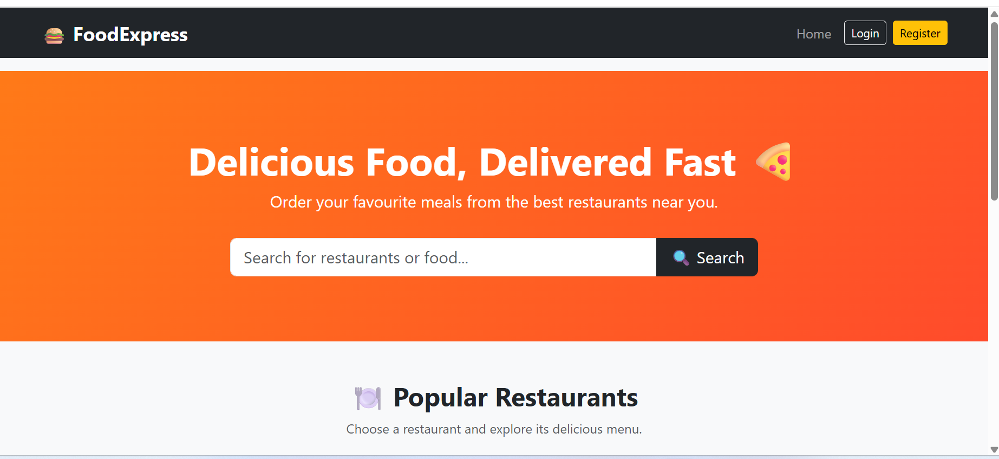
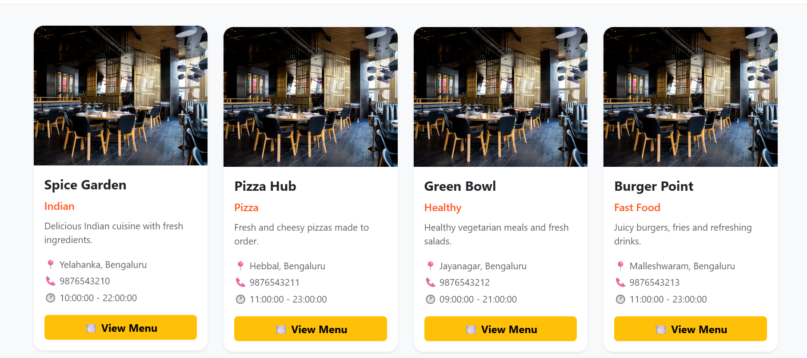
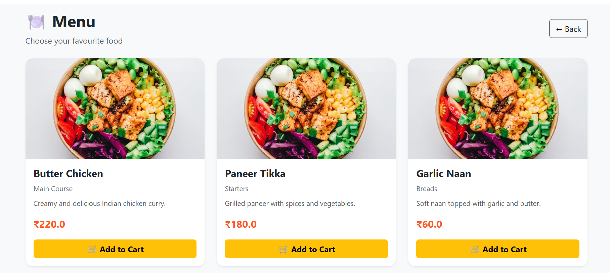
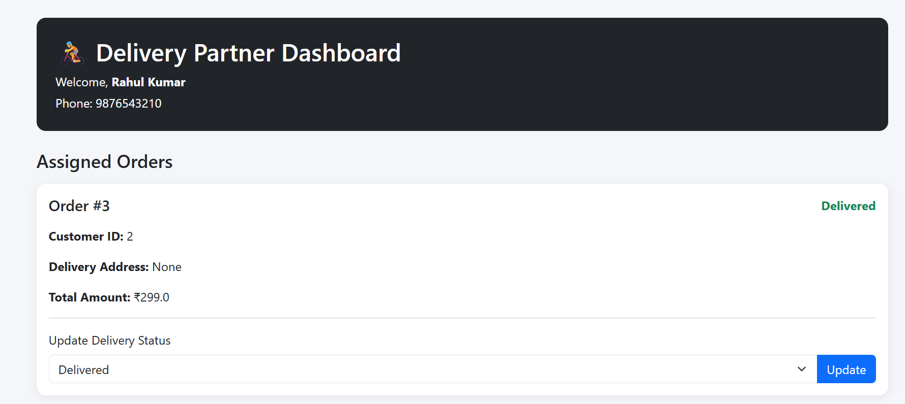
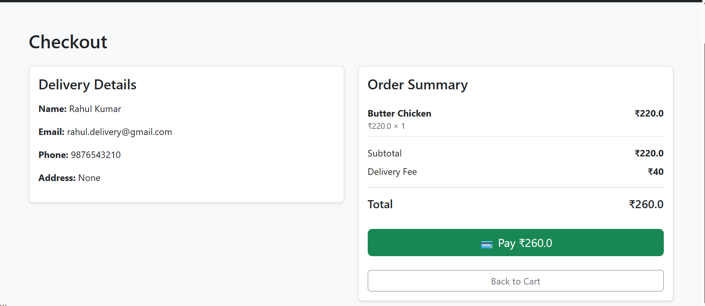

# 🍔 Food Delivery Application

A full-stack food delivery web application built using **Python Flask and MySQL**. The application allows customers to browse restaurants, view menus, add food items to their cart, place orders, make online payments, track orders, and submit restaurant reviews.

It also provides dedicated dashboards for restaurants, delivery partners, and administrators.

---

## 📌 Project Information

- **Task ID:** PY-EC-002
- **Student Code:** DAS-EC-002
- **Domain:** E-Commerce / Food Delivery
- **Framework:** Flask
- **Database:** MySQL
- **Company:** Data Alcott Systems

---

## 🚀 Features

### 👤 Customer

- User registration and login
- Secure password hashing
- Customer profile management
- Browse restaurants
- View restaurant menus
- Add food items to cart
- Update cart quantities
- Checkout
- Delivery address management
- Online payment using Razorpay Test Mode
- Order confirmation
- View previous orders
- Track order status
- Restaurant ratings and reviews
- Duplicate review prevention

### 🏪 Restaurant

- Restaurant account login
- Restaurant dashboard
- View restaurant orders
- Update order status
- Order workflow:
  - Received
  - Preparing
  - Out for Delivery
  - Delivered

### 🛵 Delivery Partner

- Delivery partner dashboard
- View assigned orders
- View customer delivery information
- Track assigned orders

### 👨‍💼 Administrator

- Admin authentication
- Admin dashboard
- View total users
- View total restaurants
- View total orders
- View delivery partners
- View delivered-order revenue
- View recent orders

---

## 🛠️ Technology Stack

### Frontend

- HTML5
- CSS3
- Bootstrap 5
- JavaScript

### Backend

- Python
- Flask
- Flask-SQLAlchemy
- Flask-Login
- Flask-Bcrypt
- Flask-WTF

### Database

- MySQL 8
- SQLAlchemy
- PyMySQL

### Payment

- Razorpay Test Mode

### Development Tools

- Visual Studio Code
- Git
- GitHub
- MySQL Workbench

---

## 📂 Project Structure

```text
food_delivery/
│
├── app/
│   ├── __init__.py
│   ├── models.py
│   ├── routes.py
│   │
│   ├── templates/
│   │   ├── base.html
│   │   ├── index.html
│   │   ├── login.html
│   │   ├── register.html
│   │   ├── profile.html
│   │   ├── menu.html
│   │   ├── cart.html
│   │   ├── checkout.html
│   │   ├── payment.html
│   │   ├── order_confirmation.html
│   │   ├── orders.html
│   │   ├── track_order.html
│   │   ├── restaurant_dashboard.html
│   │   ├── restaurant_menu.html
│   │   ├── restaurant_orders.html
│   │   ├── delivery_dashboard.html
│   │   └── admin_dashboard.html
│   │
│   └── static/
│       ├── css/
│       │   └── style.css
│       ├── js/
│       │   └── script.js
│       └── images/
│
├── config.py
├── database.sql
├── requirements.txt
├── run.py
├── .gitignore
└── README.md

---

## ⚙️ Installation and Setup

### 1. Clone the Repository

```bash
git clone https://github.com/Arpitha-23/food-delivery-application.git
cd food-delivery-application

Create a Virtual Environment:python -m venv venv
Activate the virtual environment on Windows:.\venv\Scripts\Activate.ps1
Install Required Packages:pip install -r requirements.txt
Create the MySQL Database:
     CREATE DATABASE food_delivery_db
    CHARACTER SET utf8mb4
    COLLATE utf8mb4_unicode_ci;

The complete database schema is available in:database.sql
Run the Application:python run.py
The application will start at:http://127.0.0.1:5000

💳 Payment Integration

The application includes Razorpay Test Mode for online payments.
Payment Flow

Shopping Cart
      ↓
Checkout
      ↓
Create Payment Order
      ↓
Razorpay Checkout
      ↓
Payment Verification
      ↓
Order Confirmation

📦 Order Tracking

The application provides an order tracking workflow for customers.

Received
    ↓
Preparing
    ↓
Out for Delivery
    ↓
Delivered

Customers can view the status of their own orders.

👤 User Roles

The application supports multiple user roles.

Customer

Customers can:

Register and log in
Securely manage their account
Browse restaurants
View menus
Add food items to cart
Update cart quantities
Checkout
Make online payments
View previous orders
Track orders
Submit restaurant ratings and reviews
Restaurant

Restaurant users can:

Log in to the restaurant dashboard
View incoming orders
Update order status
Manage restaurant order processing
Delivery Partner

Delivery partners can:

Access their dashboard
View assigned orders
View customer delivery information
Track assigned deliveries
Administrator

Administrators can:

View total users
View restaurants
View orders
View delivery partners
Monitor delivered-order revenue
View recent orders

🔐 Security Features

The application implements the following security features:

Password hashing using Flask-Bcrypt
User authentication using Flask-Login
Role-based access control
Protected customer orders
Protected order tracking
Restaurant-specific order authorization
Duplicate review prevention
Environment variables for sensitive credentials
.env excluded from Git
Virtual environment excluded from Git

## Screenshots

### Home Page


### Restaurant Listing


### Restaurant Menu


### Cart


### Checkout



🔮 Future Enhancements

The following features can be added in future versions:

Real-time delivery location tracking
Google Maps integration
Restaurant search and filtering
Food recommendations
Coupon and discount system
Push notifications
Restaurant analytics
Automated delivery partner assignment
Mobile application
Advanced payment options

👩‍💻 Developer

Arpitha Gowda

CSE Student

Python Full Stack Development

📄 License

This project was developed for educational and technical hiring assessment purposes.
